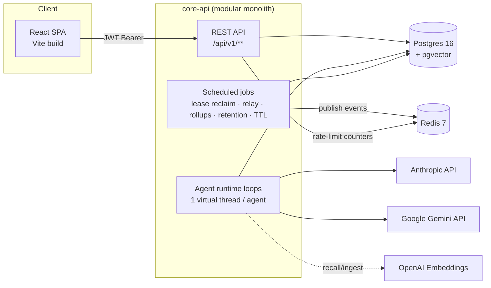
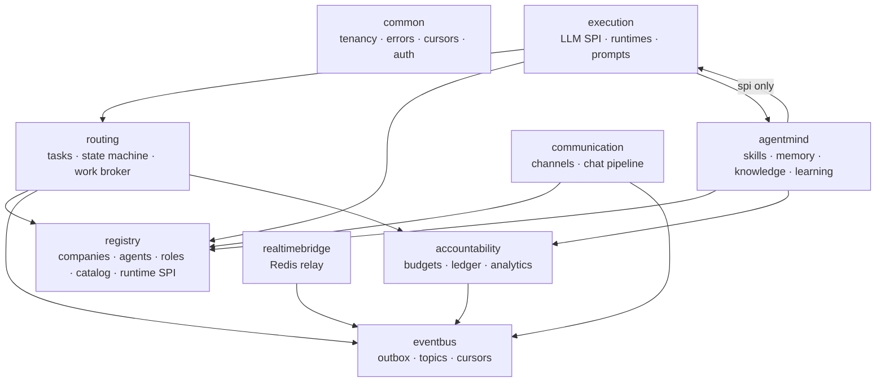
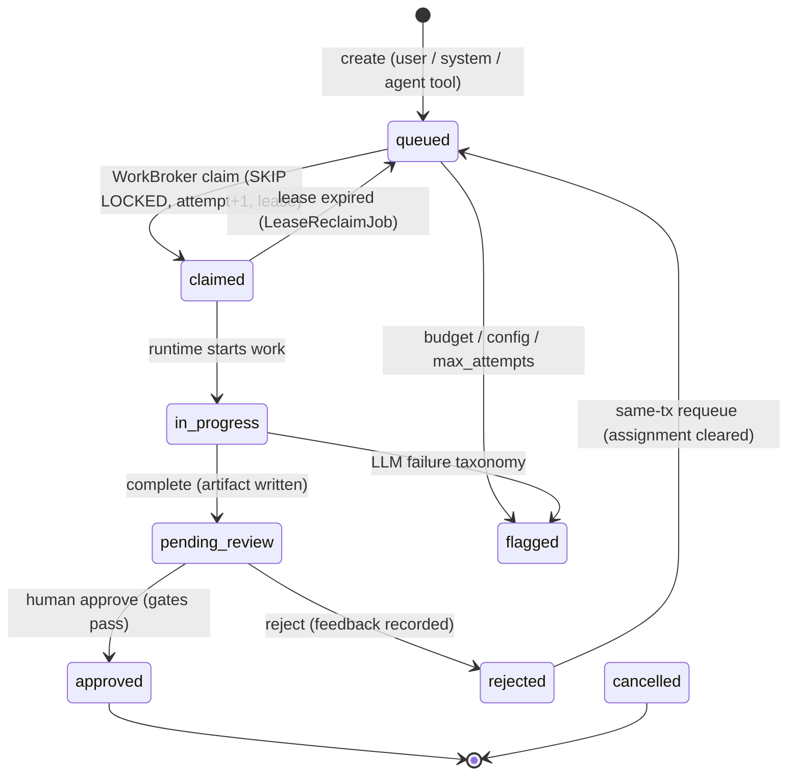
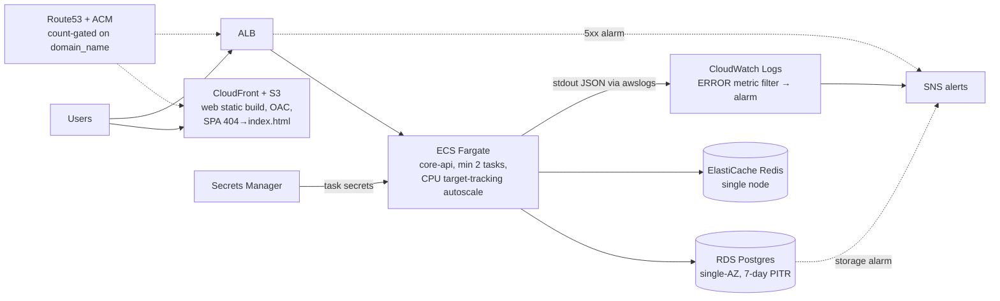

# 18 — Technical Architecture & Engineering Deep Dive

> **Audience:** engineers joining the project. This is the one document that explains how Atrium is
> actually built — the flow of the frontend and the backend, the high-level and low-level design
> patterns, the architectural choices (and the tradeoffs behind them), the data model, the event
> backbone, the testing philosophy, and the deployment story.
>
> **Relationship to the other docs:** docs 00–17 are *contracts and plans* (what to build, in what
> order). This doc is the *as-built record* (what exists, why it exists in that shape, and what it
> cost to get right). When this doc and the code disagree, the code wins; when this doc and docs
> 00–17 disagree, this doc reflects reality.
>
> **Status:** written 2026-07-18, after every Phase 0–4 milestone closed. The only open item in the
> roadmap is the live AWS `terraform apply` (an owner action, §16).

---

## Table of contents

1. [What Atrium is, technically](#1-what-atrium-is-technically)
2. [Monorepo layout](#2-monorepo-layout)
3. [High-level design](#3-high-level-design)
4. [The data layer](#4-the-data-layer)
5. [Multi-tenancy: defense in depth](#5-multi-tenancy-defense-in-depth)
6. [Authentication, authorization & API security](#6-authentication-authorization--api-security)
7. [The task lifecycle — the core domain](#7-the-task-lifecycle--the-core-domain)
8. [The event backbone — outbox, relay, pub/sub, durable consumers](#8-the-event-backbone)
9. [LLM & agent execution](#9-llm--agent-execution)
10. [Agentmind — skills, memory, knowledge, learning](#10-agentmind--skills-memory-knowledge-learning)
11. [Accountability — budgets, payroll, analytics](#11-accountability--budgets-payroll-analytics)
12. [Communication & compliance](#12-communication--compliance)
13. [Observability & operations](#13-observability--operations)
14. [Frontend architecture](#14-frontend-architecture)
15. [Testing strategy](#15-testing-strategy)
16. [Deployment: Docker, Terraform, CI/CD](#16-deployment-docker-terraform-cicd)
17. [Pattern catalog — the LLD idioms this codebase repeats](#17-pattern-catalog)
18. [The tradeoff ledger](#18-the-tradeoff-ledger)
19. [Bugs that taught us something](#19-bugs-that-taught-us-something)
20. [Where the code deliberately stops](#20-where-the-code-deliberately-stops)
21. [Suggested reading order for a new developer](#21-suggested-reading-order)

---

## 1. What Atrium is, technically

**Product framing:** a multi-tenant SaaS where companies "hire" AI agents as employees. Agents have
roles, skills, an org hierarchy, token-budget "payroll", and every piece of work they produce passes
through a human approval gate before it ships.

**Technical translation:** Atrium is

- a **modular-monolith Spring Boot backend** (`core-api/`, Java 21) built around a Postgres-backed
  work queue, an append-only audit log, and a transactional-outbox event backbone;
- a **fleet of per-agent worker loops** (one virtual thread each) that claim tasks with
  `FOR UPDATE SKIP LOCKED`, call an LLM through a provider-agnostic SPI, and submit results into a
  mandatory review state;
- a **context/learning subsystem** (skills, vector memory, knowledge docs) that assembles what each
  agent "knows" into its prompt deterministically, and extracts governed memories from review
  feedback;
- a **React SPA** (`web/`) that renders all of it — a Linear/Notion-style operations dashboard, not
  a chat window — and can run fully offline on JSON fixtures via a provider-swap store;
- **infrastructure as code** (Docker Compose locally; Terraform for ALB → ECS Fargate → RDS +
  ElastiCache + S3/CloudFront on AWS) with CI/CD in GitHub Actions.

Three sentences describe the entire runtime: *Humans (or agents, via a tool) create tasks. Agent
loops claim tasks atomically, do LLM work, and every state change lands as an immutable event row
in the same transaction. Everything downstream — live UI updates, learning, analytics, chat
notices, compliance audit — is a consumer of those events.*

### The five non-negotiables

Every design in this document exists in service of five hard rules (CLAUDE.md / doc 08):

1. **Tenant isolation everywhere** — enforced twice (app-level scoping *and* Postgres RLS).
2. **Exactly-once work accounting** — `SKIP LOCKED` claiming, leases, and idempotency keys mean a
   redelivered task never double-bills an LLM call.
3. **Append-only audit** — every task state change writes a `task_events` row *in the same
   transaction* as the change.
4. **Nothing ships unreviewed** — `pending_review` is a hard gate; for compliance-flagged roles it
   is structurally impossible to approve without an authenticated human.
5. **Roles are data** — a new agent capability is a registry row, never an `if (roleKey == …)`
   branch. This was proven twice: M1.1 added a whole business role with an empty `git diff`, and
   M-AR1 added a whole runtime type with an empty diff in routing/registry/schema.

---

## 2. Monorepo layout

```
Atrium/
├── core-api/                 # Spring Boot 3.5.x / Java 21 backend (Maven, vendored wrapper)
│   ├── src/main/java/app/atrium/
│   │   ├── common/           # tenancy, auth, filters, errors, cursors, logging, rate limit
│   │   ├── eventbus/         # outbox, topics, durable-consumer base, retention
│   │   ├── registry/         # companies, users/auth, agents, roles, model catalog, runtime SPI
│   │   ├── routing/          # tasks, subtasks, events, state machine, work broker, leases
│   │   ├── execution/        # LLM SPI + providers, agent runtimes, prompts, usage metering
│   │   ├── agentmind/        # skills, memory (pgvector), knowledge, context assembly, learning
│   │   ├── accountability/   # budgets, usage ledger, stats rollups, analytics
│   │   ├── communication/    # channels, messages, announcements, chat-notice pipeline
│   │   └── realtimebridge/   # outbox → Redis pub/sub relay
│   └── src/main/resources/db/migration/   # Flyway V1–V12 (never edited once applied)
├── web/                      # React 19 + TS strict + Vite SPA
│   └── src/{shell,pages,ui,shared,dashboard}/
├── infra/terraform/          # full AWS environment (validated, not yet applied)
├── loadtest/                 # k6 load-test script
├── .github/{workflows,scripts}/  # CI, deploy pipeline, smoke test
├── atrium-docs/              # docs 00–17 (contracts/plans) + compliance/ + this doc
├── project-graph/            # wiki-linked knowledge graph used by AI-assisted sessions
├── docker-compose.yml        # pgvector/pg16 + redis:7 + core-api, local stack
└── Makefile                  # dev / check / test entry points
```

**Build method worth knowing:** the entire project was built one milestone per session,
AI-assisted, docs-first (contract doc amended *before* code), with each milestone's "Done-when"
verified live — usually in a real browser against real containers, and where that wasn't possible,
via committed integration tests against real Postgres. That discipline shows up in the codebase as
unusually strong contract/doc alignment and in this doc's §19 as a long list of bugs caught by
*running* things rather than inspecting them.

---

## 3. High-level design

### 3.1 System context



There is exactly **one deployable backend artifact**. Agent loops, HTTP handling, and background
jobs all live in the same JVM. This is deliberate (see §18: modular monolith vs microservices) —
the module boundaries are enforced by convention + package design + an event bus, so the seams for
a future split exist without paying the distributed-systems tax today.

### 3.2 The module map and its dependency rules

The backend is package-by-module under `app.atrium.*`. Each module has a `package-info.java`
documenting its boundary. The allowed dependency directions (doc 12 §2) are the single most
important thing to internalize — several of the cleverest designs in this codebase exist purely to
avoid violating them:



Key rules, and the mechanisms that keep them true:

| Rule | Mechanism |
|---|---|
| Modules never touch each other's repositories | Cross-module reads go through small, purpose-built interfaces: `AgentDirectory`, `ModelCatalogLookup`, `RoleDefinitionLookup` (registry-owned), `BudgetGuard`/`UsageLedger` (accountability-owned). |
| `agentmind` must never import `app.atrium.execution` | It may import **only** `execution.spi` (the frozen `LlmClient` interface). When the learning pipeline needed usage metering, the metering logic was *extracted upward* into `accountability.UsageLedger` rather than importing execution (§11). |
| registry must never import agentmind, yet hire() must auto-attach skills | **Consumer-owned interface inversion**: registry declares `RoleSkillAttachment` (one method); agentmind's `SkillAttachmentService` implements it. Same shape as `AgentDirectory` but inverted — the *consumer* of the behavior owns the interface because the call site lives in registry's transaction (§17.3). |
| The `AgentRuntime` SPI lives in **registry**, not execution | Placing it in execution would create the cycle `execution → routing → registry → execution`. Registry owns the SPI; execution implements it (`LlmLoopRuntime`, `EchoRuntime`). |
| Downstream modules read **event payloads**, never upstream entities | `StatsRollupWorker` and `ChatNoticePipeline` consume `task.*` outbox events and read only payload fields (`agentId`, `requiredSkill`, `attempt`, `title`) — never a `Task` entity. When a consumer needed a field, the *payload* was extended (additive, non-breaking), not the dependency graph. |

### 3.3 Architectural style: event-driven core on a transactional outbox

Atrium is **state-machine-first, event-driven second**: the source of truth is always the Postgres
row + its append-only `task_events` history, and the event backbone is a *projection* of those
transactions, never a substitute for them. Concretely:

- **Write path:** every business mutation runs in one ACID transaction that also appends to
  `task_events` (audit) and `outbox_events` (integration). Nothing dual-writes to a broker.
- **Fan-out path:** a 250 ms relay publishes outbox rows to Redis pub/sub (`atrium:events:{companyId}`)
  for ephemeral realtime consumers, while durable consumers poll the outbox directly with their own
  persisted cursors (`event_consumers`), Kafka-consumer-group style — *without Kafka*.
- **Delivery semantics:** at-least-once, by construction (§8). Every consumer is either idempotent
  by key, idempotent by upsert + reconciliation, or explicitly lossy-OK and documented as such.

This buys the decoupling benefits of a message broker (independent consumers, replay, no lost
events on crash) with zero extra infrastructure beyond the Postgres and Redis the app already
needed. The honest cost: polling latency (≤250 ms relay tick, seconds-scale consumer ticks) and
outbox table growth (bounded by a retention job). At pilot scale, both are non-issues; the
scalability path to a real broker is documented in doc 12 and would slot in behind
`OutboxRelayGateway` without touching business code.

---

## 4. The data layer

### 4.1 Engine and extensions

Postgres 16 via the `pgvector/pgvector:pg16` image. pgvector powers memory/knowledge semantic
recall (`vector(1536)` columns + HNSW index). Redis 7 serves three distinct jobs — realtime event
pub/sub, rate-limit counters, and nothing else (it is never a source of truth).

### 4.2 Flyway discipline

All schema lives in `core-api/src/main/resources/db/migration/`, `V<N>__desc.sql`, **never edited
once applied** (the one exception in project history was an uncommitted V4 on a throwaway dev DB,
handled by resetting the volume rather than shipping an "oops" migration). Naming: DB is
snake_case, JSON is camelCase, events are dot.case.

| Migration | What it does |
|---|---|
| `V1__core.sql` | Companies, users, tasks, subtasks, task_events, artifacts, budgets, usage_records, outbox_events, event_consumers, task_decompositions… (doc 03 §V1 verbatim + doc 15 §1 ALTERs folded in) |
| `V2__agent_platform.sql` | The full Rev C agent platform: role_definitions, agents, model_catalog, skills, role_definition_skills, agent_skills, memories, knowledge_docs, knowledge_chunks, role_definition_knowledge; `CREATE EXTENSION vector` |
| `V2_1__seed.sql` | Global role templates (coder/tester/research) + model catalog (Claude Fable 5 / Sonnet 5 / Haiku 4.5) |
| `V3__budget_alerted_at.sql` | Budget threshold-alert dedup column |
| `V4__google_model_catalog.sql` | Gemini 3.1 Flash-Lite catalog row (the free-tier demo path) |
| `V5__seed_platform_skills.sql` | 6 platform skills attached to the 3 global templates |
| `V6__agent_stats_daily.sql` | Analytics rollup table, PK `(company_id, agent_id, skill, day)` |
| `V7__communication.sql` | channels / messages / announcements |
| `V8__users_auth.sql` | `users.password_hash` — real auth |
| `V9__seed_starter_roster_templates.sql` | lead / product / content global templates (onboarding packs) |
| `V10__tenant_rls.sql` | Row Level Security on every tenant table + the `atrium_app` least-privilege role (§5) |
| `V11__compliance_gate.sql` | `role_definitions.review_required` |
| `V12__seed_compliance_roles.sql` | legal / hr global templates, `review_required=true`, `allowed_tools:[]` |

An important historical quirk: **V2 pasted the entire future schema up front** — `skills`,
`memories`, `knowledge_*` existed as tables for many sessions before any Java touched them. Later
milestones (M-SK1, M-MEM1, M-KN1) were therefore Java/API-only. Every one of those sessions was
surprised by this; you now don't have to be.

### 4.3 Schema invariants that shape the code

- **`company_id` on every tenant-owned table** (or reachable via a mandatory join for pure join
  tables like `subtasks`, `agent_skills`). This is what makes both isolation layers (§5) possible.
- **`task_events` is append-only** — the entity has no setters and `payload` is
  `updatable = false`. Anything that must appear in an event (e.g. context provenance in the
  `claimed` event) has to be present *at write time*, which directly caused the enricher-hook
  design in §10.2.
- **Approval blocks on open children** — a parent task cannot be approved while any child task or
  checklist subtask is open (03 invariant 5, enforced in `TaskService.approve`).
- **`billing_task_id`** propagates the root task down a delegation chain so cost always
  *attributes* upward. (Attribution, not monetization — Stripe/billing is deferred post-pilot and
  nothing in the ledger depends on it.)
- **Versioned definitional rows** — `role_definitions` and `skills` are immutable-ish: a change is
  a *new row* with a bumped version under `UNIQUE(company_id, key, version)`; agents are frozen to
  the exact `role_definition_id` they were hired against. Combined with the completion audit
  (§12.2), `roleDefinitionId + promptVersion` in an event addresses the *exact* immutable system
  prompt that produced an output.
- **Global-vs-owned rows share tables**: `company_id NULL` = global template (roles, skills),
  non-NULL = company-owned. `UNIQUE(company_id, key, version)` treats NULL as distinct, so a tenant
  can shadow a global key without collision.

### 4.4 Pagination

All list endpoints use **keyset pagination**, never OFFSET: `(created_at, id) < cursor` descending,
cursor = base64url `ISO|uuid` (`common.KeysetCursors`), wrapped in `PageEnvelope{data, nextCursor?}`.
Malformed cursors are a 400, not a 500. This is stable under concurrent inserts (a task board that
updates every few seconds) and O(log n) regardless of depth.

---

## 5. Multi-tenancy: defense in depth

Isolation is the #1 hard rule and the only one enforced by **two independent mechanisms**, verified
to be genuinely independent (§5.4).

### 5.1 Layer 1 — application-level scoping

Every repository method takes a `companyId`. Every endpoint resolves the tenant from
`TenantContext` (never from a request body). Join-table entities without their own `company_id`
(subtasks, agent_skills…) are only reachable through EXISTS-joins on their owning row. A
cross-tenant read is a **404, never a 403** — the API refuses to even confirm the resource exists.

`common.TenantContext` is a ThreadLocal holding `Tenant(companyId, userId, role)`. It is bound in
exactly three ways:

- **HTTP:** `TenantContextFilter` validates the JWT and binds per request (§6.1).
- **Background/system:** `TenantContext.runAsSystem/callAsSystem(companyId, …)` — for agent poll
  loops and the Worker API, where a known company acts without a human.
- **Genuinely cross-tenant system paths:** `runWithBypass/callWithBypass` — pre-auth signup/login
  and the Worker gateway's own agent→company lookup, which is inherently pre-tenant.

`TenantContext.set/clear` is the **one doorway** for tenant binding, which is also why structured
logging got tenant fields for free (§13.1).

### 5.2 Layer 2 — Postgres Row Level Security (V10)

Every tenant table has `ENABLE + FORCE ROW LEVEL SECURITY` and a policy of the shape
`company_id = current_setting('app.company_id', true)::uuid`, with variants:

- strict equality for NOT-NULL `company_id` tables (tasks, agents, users, memories, …);
- NULL-or-match for global-template tables (role_definitions, skills);
- id-based for `companies` itself;
- EXISTS-join policies for the four join tables with no own `company_id`;
- `model_catalog` / `event_consumers` deliberately excluded (fully global, no tenant concept);
- an `app.bypass_rls = 'on'` escape-hatch clause for legitimate cross-tenant system reads.

**How the GUCs get set:** `common.TenantAwareJpaTransactionManager` subclasses
`JpaTransactionManager` and overrides `doBegin` to issue
`SELECT set_config('app.company_id', …, true)` / `set_config('app.bypass_rls', …, true)` right
after the transaction opens (`set_config`, not `SET` — the JDBC driver can't bind parameters into
`SET`). The `true` third argument makes it transaction-scoped, so nothing leaks across pooled
connections.

**Consequence every developer must know:** *any repository call needs a real Spring-managed
transaction somewhere in its call chain, or RLS silently returns zero rows.* This is not
hypothetical — two production services (`AnnouncementService.list`, `ChannelService.list*`) had no
`@Transactional` at all and silently read nothing the day RLS landed (§19).

**The superuser finding.** Postgres never enforces RLS for a superuser, and the official
`postgres` Docker image's bootstrap role *is* one — worse, Postgres refuses to ever strip
SUPERUSER from the bootstrap role. So V10 performs a genuine privilege split: it creates a
least-privilege `atrium_app` role (`NOSUPERUSER NOBYPASSRLS`) that the application's
`spring.datasource` connects as, while **Flyway keeps the bootstrap credentials** (it needs DDL).
Two credential sets, wired via `spring.datasource.*` vs `spring.flyway.*`
(`ATRIUM_APP_DB_USER/PASSWORD` env vars). On AWS RDS the master user is never a true superuser, so
this split is a local-dev/CI correctness requirement, not an RDS concern.

### 5.3 Cross-tenant background jobs

Five jobs (`LeaseReclaimJob`, `OutboxRelay`, `OutboxRetentionJob`, `MemoryTtlArchiver`,
`StatsRollupReconciliationJob`) plus `EventCursorWorker.pollOnce` legitimately read across all
tenants. Rather than a clever wrapper, each one's *existing* `@Transactional` method simply issues
`SELECT set_config('app.bypass_rls','on',true)` as its literal first statement —
`set_config(…, true)` takes effect for every statement issued after it in the same transaction. (A
`@Lazy`-self split-method design was built first and *reverted* once this simpler truth was
confirmed — an example of the project's bias toward the smallest mechanism that is actually
correct.)

### 5.4 Proving the layers are real

`IsolationHardeningTest` gives company A one of every resource, then hits ~25 endpoints with
company B's valid token and asserts 404s (plus a company-A control group proving the endpoints
work, a Worker-API axis case, and a Redis channel-namespacing case). But the decisive verification
was **plant-a-bypass**: (1) with an app-level filter deliberately removed, the suite still passed —
RLS alone caught the leak, proving genuine defense-in-depth rather than two copies of one check;
(2) with RLS *also* forced off, the suite went red — proving the tests have real teeth and aren't
tautologically green. Both bypasses were reverted and grep-verified gone. Adopt this technique any
time you touch isolation: prove the test can fail.

---

## 6. Authentication, authorization & API security

### 6.1 Human auth: JWT without Spring Security

`POST /auth/signup` creates the company + first admin user (BCrypt hash) in one transaction and
issues an HS256 JWT (`jjwt`); `POST /auth/login` verifies and re-issues. Claims: `sub` = userId,
`companyId`, `role`. 30-day expiry, no refresh flow yet. Secret via `ATRIUM_JWT_SECRET` (an
insecure committed dev fallback exists and is documented as MUST-override for any shared env).

**Deliberate non-choice: no `spring-boot-starter-security`.** The tenant filter was already a
hand-rolled `OncePerRequestFilter`; pulling in the full framework would have meant configuring
*away* CSRF/form-login/filter-chain machinery the app never wanted. Instead: `spring-security-crypto`
(just `BCryptPasswordEncoder`) + `jjwt` (issue/verify only). `TenantContextFilter` requires
`Authorization: Bearer` on every `/api/**` route except the pre-auth pair and the Worker API;
missing/invalid → 401 problem+json. `role` rides the token but nothing gates on it yet
(single-admin-per-company reality; RBAC is future work).

### 6.2 The second auth axis: the Worker API

`POST /tasks/{id}/claim` and `/tasks/{id}/lease/renew` (`WorkerTaskController`) authenticate by
**`X-Agent-Id`**, not JWT — this is the gateway a future *external* runtime (webhook/process) would
use. The controller resolves its own tenant via `AgentDirectory.companyIdOf(agentId)` (the one
deliberate exception to "no lookup without a companyId param" — it returns only the id, agent-only).
This decoupling was a real design improvement found during the auth milestone: claims used to
implicitly require a bound *human* tenant purely as an accident of the old all-routes-need-headers
rule.

### 6.3 Rate limiting

`common.RateLimitFilter` — Redis-backed **fixed-window counters** (`StringRedisTemplate`), ordered
immediately after `TenantContextFilter` so it can read the bound tenant. Redis, not in-memory,
because ECS runs ≥2 tasks and per-instance counters would grant each task its own quota to the same
caller. Three scopes, matching the three real traffic axes:

| Scope | Key | Why |
|---|---|---|
| Company id | authenticated `/api/**` traffic | normal tenant fairness |
| `X-Agent-Id` | Worker API | agents are their own principal axis |
| Client IP (`X-Forwarded-For` → `getRemoteAddr()`) | `/auth/signup`, `/auth/login` | the pre-auth abuse surface, where no tenant exists yet |

Rejections are `429 + Retry-After`, never a silent drop. Config:
`atrium.rate-limit.{enabled,default-per-minute,auth-per-minute,worker-per-minute}`. **Disabled by
default under the `test` profile** (the whole integration suite shares one Testcontainers Redis;
helper signups would throttle unrelated tests) — `RateLimitFilterTest` re-enables it via
`@TestPropertySource` and gets a dedicated Spring context for free.

### 6.4 The compliance gate (M4.1)

`role_definitions.review_required` (default false, settable on custom roles too). Enforcement is
**structural, not UI-convention**: `TaskService.approve()` calls `requireHumanSignOffIfGated`,
which resolves the *assigned agent's* role (not the approver's) and throws `ForbiddenException`
(403) unless `TenantContext.userId()` is bound. A background job or test calling `approve()` via
`runAsSystem` — which binds no user — is rejected identically to any other caller; there is no code
path that approves a gated role's task without a real authenticated human, and the test suite
proves it by deliberately trying. The seeded `legal`/`hr` templates ship gated with
`allowed_tools: []` — they can draft, never send/file/execute.

### 6.5 Secrets hygiene

- Provider keys live only in env (`ANTHROPIC_API_KEY`, `GOOGLE_API_KEY`, `OPENAI_API_KEY`) →
  Secrets Manager → ECS task secrets in prod. A missing key never fails boot; it parks the affected
  capability (§9.4).
- **`PromptAssembler` is pure**: it sees only role definition + task + feedback + context bundle.
  Secrets structurally cannot reach a prompt because the assembly function has no path to them.
- Google auth uses the `x-goog-api-key` *header*, never the `?key=` query param — keys stay out of
  URL/access logs.
- Exception text never contains key material (pinned by tests).

---

## 7. The task lifecycle — the core domain

Everything else in Atrium orbits this pipeline. Read this section twice.

### 7.1 The state machine



`routing.domain.TaskStateGuard` owns the full transition matrix and is the **sole caller** of
`Task`'s *package-private* `setStatus` — Java visibility used as an architectural fence. An illegal
transition throws `ConflictException` → 409. No service, test, or job can push a task through an
edge the matrix doesn't allow.

### 7.2 Claiming: exactly-once under concurrency

The canonical claim (doc 03, `PostgresWorkBroker`) is one atomic statement:

```sql
UPDATE tasks SET status='claimed', assigned_agent_id=$agent,
       attempt = attempt + 1, lease_expires_at = now() + interval '10 minutes'
WHERE id = (
  SELECT id FROM tasks
  WHERE company_id=$company AND status='queued' AND required_skill = ANY($skills)
    AND NOT EXISTS (…paused-agent guard…)
  ORDER BY priority, created_at
  FOR UPDATE SKIP LOCKED LIMIT 1
) RETURNING id;
```

- `FOR UPDATE SKIP LOCKED` makes N concurrent claimers contend without blocking and guarantees each
  task has exactly one winner — verified by a test running 3 workers × 20 tasks and asserting 20
  distinct winners, only 200/409 responses, `attempt=1` and exactly one `claimed` event each.
- Pre-flight checks (agent exists in-tenant, skill match, not paused, `BudgetGuard.canSpend`) exist
  to give **clear 409s**; the SQL guards remain authoritative under races. A losing claim's 409
  names the current holder and says "do not retry".
- Raw `JdbcTemplate` is used here on purpose: Spring Data has no portable way to express
  `SKIP LOCKED … LIMIT`. This is one of the codebase's standing idioms — *raw SQL for
  Postgres-extension mechanics, JPA for plain entity work* (§17.6).
- After the JDBC write, the broker calls `em.refresh(task)` before recording the event — otherwise
  the recorder would serialize a stale `queued` status into the outbox payload.

**Leases.** A claim carries a 10-minute lease; `renewLease` (heartbeat) extends it — deliberately
*without* a task_event, because a heartbeat is not a state change. `LeaseReclaimJob` (scheduled,
`pg_try_advisory_xact_lock` singleton so multi-instance deploys elect one sweeper; the *xact*
variant so a crash can't wedge the lock) sweeps expired leases back to `queued`, clears the
assignment, and records a `requeued` event with `previousAgentId`. The next claim gets a fresh
`attempt` — which is the linchpin of billing idempotency:

**Idempotency keys.** `usage_records.idempotency_key = "{taskId}:{attempt}"`, inserted with
`INSERT … ON CONFLICT DO NOTHING` (DB-level, correct under concurrent runners — never
check-then-insert). A redelivered attempt replays as a silent no-op; a genuinely new attempt gets a
new key. The learning pipeline uses the same ledger with `learn:{eventId}` keys (§11.1).

### 7.3 Review: approve and reject

- **Approve** runs three gates in order: no open child tasks, no open checklist subtasks, then the
  compliance human-sign-off gate (§6.4) — then `TaskStateGuard.transition(task, "approved")`.
- **Reject** is the subtle one. The guard legally allows `pending_review → in_progress` directly,
  but taking that edge would leave the task assigned to the same agent *without re-claiming* — the
  retry would reuse the same `attempt`, its usage insert would silently no-op against the original
  idempotency key, and **real LLM spend would go unrecorded**. So `reject()` takes a two-hop path
  inside one transaction: `pending_review → rejected` (records the `rejected` event with
  `{feedback}`) then immediately `rejected → queued` + `clearAssignment()` (records `requeued`).
  Only the final `queued` state is ever externally visible, and the redo flows through the normal
  claim path with a fresh attempt. Rejection feedback is later read back from the event log
  (`latestRejectionFeedback`) and injected into the retry prompt as
  `## Reviewer feedback (attempt N)`.

### 7.4 Decomposition: agent-created work, exactly once

PM/lead-type roles carry `allowed_tools: ["create_child_tasks"]` (pure data — offering the tool to
the LLM is gated on the role row, zero role-key branching anywhere). When the model invokes it,
`TaskService.completeWithDecomposition` completes the parent (its completion artifact **is** the
plan) and calls `decompose()`, whose exact-once fingerprint is
`INSERT INTO task_decompositions (parent_task_id, plan_artifact_id) ON CONFLICT DO NOTHING`:
`rows==1` → this call won and creates the children (each child's `created` event actor is
`agent:<id>` via a service overload); `rows==0` → a replay, which becomes a no-op returning the
existing `child_task_ids`. Keying the fingerprint on the parent's *own* completion artifact avoided
inventing a redundant "plan" row.

`GET /tasks/{id}/flow` returns the whole chain as `{nodes, edges}` from *any* task in it: walk up
`parent_task_id` to the root, then one `WITH RECURSIVE` CTE for the full subtree.

**Scope cut, documented:** tool use is **single-shot** — a `create_child_tasks` call is the whole
outcome of that attempt, no multi-turn loop. A real loop requires replaying the assistant's
structured `tool_use` block into the next request, which the frozen plain-string `LlmMessage` SPI
can't carry; extending a frozen SPI mid-milestone wasn't worth it. `maxToolTurns` exists in config,
validated, unused — a labeled seam, not an accident.

### 7.5 Audit

`routing.TaskEventRecorder.record(task, type, actor, payload)` is the **one** helper that writes
`task_events` + the corresponding outbox event, and it is `Propagation.MANDATORY` — calling it
outside a business transaction is an `IllegalTransactionStateException`, making the "audit in the
same tx" invariant *structural* rather than reviewed-for. Actor strings are typed:
`user:<id>` / `agent:<id>` / `system`. Since M4.2, a completion can also carry a
`CompletionAudit` payload (§12.2), making every LLM-backed completion reconstructable from
`GET /tasks/{id}/events` alone.

---

## 8. The event backbone

### 8.1 Transactional outbox

`eventbus.OutboxWriter.append` is `Propagation.MANDATORY` (same structural trick as the audit
recorder): an outbox append can only ever happen inside the business transaction that caused it.
One commit atomically persists {state change, audit event, outbox event} or none of them. There is
no dual-write problem anywhere in the codebase *by construction*.

Topics follow the doc 12 §4 taxonomy — `atrium/v1/{companyId}/task/{taskId}`,
`…/agent/{agentId}`, `…/budget/{agentId|company}`, `…/chat/{channelId}`, `…/memory/{agentId}` —
built by `Topics`, never hand-assembled strings.

### 8.2 The relay (ephemeral fan-out)

`realtimebridge.OutboxRelay` runs every 250 ms under its own advisory-lock key (distinct from the
reclaim and retention jobs — each singleton job owns a unique lock constant). One transaction:
claim a batch of unpublished rows via `OutboxRelayGateway.claimPending` (`FOR UPDATE SKIP LOCKED`),
publish each to Redis channel `atrium:events:{companyId}` as `{type, …payload, ts}`, mark
published. **At-least-once falls out of the transaction shape**: a crash between claim and commit
leaves nothing marked published, so the next tick's `SKIP LOCKED` re-claims the same rows. No retry
wrapper exists because none is needed. Micrometer meters: `atrium.relay.lag` (timer) and
`atrium.relay.pending` (gauge) — the first metrics in the codebase.

`OutboxRelayGateway` is realtimebridge's *only* doorway into the outbox table — the seam where a
real broker (Kafka/SNS) would slot in later.

### 8.3 Durable consumers (the "Kafka consumer group" without Kafka)

`eventbus.EventCursorWorker` is the abstract base: poll a batch of outbox rows beyond your persisted
cursor (`event_consumers` row per consumer name), handle each, advance the cursor — **all in one
transaction**, so a crash mid-batch redelivers the whole batch (at-least-once). Three real
subclasses, each with a distinct idempotency posture — a useful menu when you write the fourth:

| Consumer | Consumes | Idempotency posture |
|---|---|---|
| `agentmind.LearningPipeline` | `task.rejected/approved/completed` | **Hard-keyed**: `learn:{eventId}` in the usage ledger + ≥0.92-cosine memory dedup → replay bumps importance instead of duplicating |
| `accountability.StatsRollupWorker` | `task.completed/approved/rejected` | **Additive upserts, safe under the batch-tx crash guarantee but not under a forced cursor rewind** — honestly documented, and exactly why the nightly `StatsRollupReconciliationJob` recomputes trailing 2 days from raw `outbox_events` + `usage_records` |
| `communication.ChatNoticePipeline` | `task.completed` | **Lossy-OK by design** (it's a chat log, not billed state) — documented in the class |

`OutboxRetentionJob` (nightly, advisory-lock singleton) purges published rows that are both >14
days old *and* at-or-below every consumer's cursor — the outbox is never purged ahead of a reader,
which is also what makes the reconciliation job's "recompute from raw events" honest.

All `@Scheduled` consumers use the **`@Lazy`-self idiom** (§19, bug #2): the scheduled `poll()`
calls `self.pollOnce(...)` through the injected proxy, never bare `this.pollOnce(...)` — a plain
self-call bypasses Spring's transactional proxy and every `MANDATORY` write inside would explode at
runtime while compiling clean.

---

## 9. LLM & agent execution

### 9.1 The provider SPI (doc 13 §1 — frozen, normative)

`execution.spi`: `LlmRequest/LlmResult/LlmMessage/LlmToolDef/LlmToolCall` records +
`LlmProvider` (one per vendor) + `LlmClient` (what callers use) + `LlmException` with a **7-kind
taxonomy** — `RATE_LIMITED, PROVIDER_DOWN, AUTH, UNKNOWN_MODEL, CONTEXT_TOO_LONG,
CONTENT_FILTERED, INVALID_REQUEST` — each kind's javadoc specifying required runner behavior.
Callers never see vendor SDK types; providers never see Atrium domain types.

`LlmRouter implements LlmClient` fronts a Spring-injected `List<LlmProvider>` bean map:
model-catalog validation (via `registry.ModelCatalogLookup` — execution never touches the
repository), a 120 s Future-based timeout mapped to `PROVIDER_DOWN`, and **in-attempt retries per
taxonomy**: `RATE_LIMITED` ×3, `PROVIDER_DOWN` ×2, everything else fails fast. Backoffs are
config (`atrium.llm.retry.*`) so tests set `Duration.ZERO` and count the calls exactly.

Two providers prove the seam:

- **`AnthropicClient`** — official SDK, with `.maxRetries(0)` because the SDK's own 429/5xx
  auto-retry would silently *double-retry* under the router. `baseUrl` is config → WireMock
  override point. Stop-reason mapping normalizes vendor vocabulary (`refusal` → *throws*
  `CONTENT_FILTERED`, never a "filtered" result).
- **`GoogleClient`** — plain Spring `RestClient` REST, no SDK. Vendor quirks absorbed inside the
  adapter: tool schemas down-converted to Gemini's OpenAPI-3.0 subset; `finishReason: STOP` even on
  tool calls, so stop-reason derives from `toolCalls` non-emptiness; tool results ride back as
  role-`user` `functionResponse` parts. Lesson learned live: **list-and-probe the real key, don't
  trust model names from docs/memory** — the models docs suggested 404'd for new keys;
  `GET /v1beta/models` found the real free-tier model.

`LlmCostCalculator` converts token counts × catalog µUSD/MTok prices (half-up per component).
Prices live in `model_catalog` rows (tiers `deep/balanced/fast`), so pricing is data too.

**The proof the SPI works:** adding the whole Google provider — and later, the M1.1 business role,
and the M2.1 PM/designer roles — required *zero* changes to router, runtime, routing, or registry.

### 9.2 The runtime SPI

`registry.runtime.AgentRuntime` (doc 13 §3.1): `type() / validateConfig / start / stop / health`.
`RuntimeRegistry` collects all runtime beans by Spring `List<AgentRuntime>` injection into a
`type()`-keyed map; `AgentService.hire()` validates and stores `runtime_type` + `runtime_config`
generically. Unknown config keys are a 400 with `fieldErrors` (strict allow-list per runtime).

Two implementations:

- **`LlmLoopRuntime`** (`type = "llm_loop"`) — the real one, below.
- **`EchoRuntime`** (`type = "echo"`) — same poll shape, no LLM: claims and completes with a canned
  artifact. Its entire reason to exist is the pluggability proof: it was added with a
  **git-diff-verified empty diff** across routing, registry, and the schema. The external-runtime
  gateway (webhook/process + fat-claim `ContextBundle` in the claim response) remains a labeled
  TODO for when a real external caller exists.

### 9.3 Lifecycle

`registry.AgentLifecycleService` starts an agent's loop on hire/unpause and stops it on pause —
**deferred via `afterCommit` transaction synchronization**, because `hire()` is still mid-transaction
when lifecycle fires, and a poll tick landing before commit would 404 on its own agent row. Budget
breaches pause agents through `AgentDirectory.pauseForBudget` (wired with a `@Lazy` constructor
param to break an eager init cycle through `RuntimeRegistry → LlmLoopRuntime → WorkBroker →
AgentDirectory`).

### 9.4 One loop iteration (`LlmLoopRuntime.runOnce`)

One **virtual thread per active agent** (Java 21 — the reason the project bumped from 17), tracked
in a `ConcurrentHashMap`, interrupted on stop, `@PreDestroy stopAll()` on shutdown. Each ~15 s
tick:

```
0. Pre-dispatch gate     — ProviderReadiness.isReady()? If the agent's provider has no key,
                           park silently. Never claim work you can't perform.
                           (ProviderReadiness is deliberately NOT on the frozen LlmProvider SPI.)
1. Claim                 — WorkBroker.claimNext(company, agent, skillTags). Inside the claim tx,
                           the context-enricher lambda runs (§10.2) so provenance lands in the
                           claimed event. maxAttemptsPerTask pre-check flags before any spend.
2. progress()            — claimed → in_progress (the guard has no claimed→pending_review edge;
                           found by a failing test, §19).
3. Assemble prompt       — ContextAssembler.assemble(agent, task) → ContextBundle;
                           PromptAssembler.build(roleDef, task, rejectionFeedback, bundle) —
                           pure function, returns AssembledPrompt(systemPrompt, messages).
4. LLM call              — llmClient.complete(request) with tools only if the role's
                           allowed_tools grants them.
5-7. Settle              — ONE explicit TransactionTemplate transaction shared by
                           UsageRecorder.record (MANDATORY — joins) and TaskService.complete
                           (REQUIRED — joins): spend and state commit or roll back together.
                           On LlmException: FlagReasons maps kind → flag(), loop never crashes.
```

`runOnce` is public so tests drive it deterministically instead of racing the poll timer — a
project-wide testing convention.

---

## 10. Agentmind — skills, memory, knowledge, learning

This module is the product differentiator: what an agent *knows* and how it *learns*, all
governed, all reaching prompts through one doorway.

### 10.1 The doorway: ContextAssembler

`SkillContextAssembler.assemble(agent, task)` → `ContextBundle{skills, memories, knowledge}` —
deterministic (two calls on the same state are `equals()`-identical), pure local-DB reads, under a
token budget:

- Budget = `runtime_config.contextBudgetTokens` (default 4000), hard-capped at **30 % of the
  model's catalog context window**; chars/4 estimation heuristic, documented.
- **Skills ≤ 50 %** of budget: role-attached ("hired") skills in the role's seeded position order
  first, then agent-attached ("assigned"/"learned") by proficiency desc, deterministic tiebreaks.
  Item-granular truncation: full `body_md` if it fits → a name+description index line → dropped,
  and the loop *continues* to smaller items rather than aborting. Only `platform`/`company` trust
  levels ever render; `agent_proposed` skills are structurally inert until humanly promoted.
- **Memories ≤ 35 %**: `recall(k=12)` on `task.title+description`, reordered
  preference/lesson-before-fact/summary, then score. No fallback line — memory content is short by
  convention; an oversized item is dropped whole.
- **Knowledge ≤ 15 %**: top-3 chunks by plain cosine ≥ 0.35, only for docs attached to *this
  agent's role*.

`PromptAssembler` renders the bundle into the normative layout (doc 14 §6): `## Your skills`,
`## What you have learned here` (with a `_Learned context — verify if critical._` disclaimer),
`## Reference material`, `## Reviewer feedback (attempt N)`. Sections with no content are omitted —
and the render branches were literally *not written* until the milestone that gave them real
content, so no dead code ever shipped.

### 10.2 Provenance in the claimed event — the enricher hook

Requirement: the `claimed` audit event must record *which* skills/memories/knowledge went into the
attempt (`contextProvenance`). Constraints: `task_events` is append-only (no patching after
commit), the claimed event is written by routing at claim time, and routing must not import
agentmind. Resolution: `WorkBroker.claimNext` takes a plain-JDK `@Nullable Function<Task,
ObjectNode>` enricher — no named cross-module interface, so routing pays no import — invoked inside
the claim transaction right before the event write. `LlmLoopRuntime` passes a lambda that runs
`contextAssembler.assemble()` once, captures the bundle for reuse when building the prompt, and
returns the provenance node. Cost accepted: the claim row-lock is held a few extra local-DB reads
longer — plus, since M-MEM1, one live embedding call (~100–300 ms), because the query text is
task-specific and the event is append-only, so there is nowhere earlier to compute it. The
documented escape lever if it ever bites: async pre-embedding of queued tasks.

### 10.3 Memory: `PgVectorMemoryStore`

`MemoryStore` is a real SPI (ingest/recall/forget/setStatus/findDuplicate/promoteScope) —
implemented raw-JDBC throughout. The `Memory` JPA entity deliberately **excludes** the `embedding`
column; exactly one class ever reads/writes vectors, as pgvector text literals cast via
`::vector`. This JPA/raw-JDBC split is a load-bearing convention with a warning attached: *mixing
the two write paths in one transaction requires explicit synchronization* — it produced two real
bugs in opposite directions (§19, bugs #5 and #6).

Recall scoring (doc 14 §2, computed in a subquery so the outer query filters/orders on the
composed score):

```
score = 0.75·cosine_similarity + 0.15·recency_decay(30-day half-life) + 0.10·min(use_count,10)/10
threshold 0.30 · scope-set = agent-own ∪ role ∪ all company · task-scope excluded by construction
```

Post-recall, `use_count`/`last_used_at` are batch-bumped (which is why the assembler's
`@Transactional` is *not* readOnly — a caught-before-ship regression).

**Degrade, never block:** embeddings are a separate provider key (`OPENAI_API_KEY`) from the LLM
keys. Every embedding call site follows the same posture: `isReady()` false or a live failure →
recall returns empty, ingest lands the row with a NULL embedding (browsable, not semantically
recallable until re-embedded), and **nothing ever throws into the claim loop**. This posture was
retrofitted onto `ingest()` after the review-queue milestone discovered extraction had silently
never written a row in the project's history (§19, bug #7). Lifecycle: `MemoryTtlArchiver`
(nightly, advisory-lock) archives `lesson`/`summary` rows unused past `atrium.memory.ttl-days`
(default 90); `fact`/`preference` never age out; `forget` archives, never hard-deletes.

### 10.4 Knowledge

`KnowledgeService`: ingest (chunk ~800 tokens/100 overlap via `KnowledgeChunker`, batch-embed,
raw-JDBC chunk insert), list/archive, attach-to-role, recall. **No separate portable SPI** — doc 14
doesn't describe knowledge as a swappable contract, so no interface indirection was invented
(contrast `MemoryStore`; adding abstraction only where the contract demands it is a deliberate
stance). Scoping is structural: a doc surfaces only for role_definitions it's attached to via an
INNER JOIN — and attach is restricted to **company-owned** role definitions, because
`role_definition_knowledge` has no company_id and attaching to a global template (one shared row)
would leak the doc reference into every tenant's future hires. Practical consequence: an agent
hired straight from a global template can never receive company knowledge; hire against a custom
role for that.

### 10.5 Learning: the governed pipeline

`LearningPipeline extends EventCursorWorker`. Per trigger event it resolves the working agent + a
`tier='fast'` catalog model *for the same provider the agent already uses*, and runs a
structured-output extraction (prompts are static-final Java strings, matching the codebase's
prompt convention):

- **rejected** → up to 3 `{content, kind, scope}` items from reviewer feedback;
- **approved** → same, but only when `attempt > 1` or a prior rejection exists (a clean first-try
  approval extracts nothing — saves the call);
- **completed** → one ≤120-token episodic summary, kind/scope forced in *code*.

**Governance is one function**, `decideStatus(scope, kind)`, and it never trusts the extraction
model's opinion of its own blast radius: auto-`active` only for agent-scope lesson/summary;
**every** role/company-scope write and **every** `fact` lands `pending_review`. The review queue
(`GET …/memories/review-queue`, `POST /memories/{id}/review`) lets a human approve/reject, with
optional `promoteScope` and `asSkill` (spins off a `trust_level='agent_proposed'` draft skill —
which stays inert in prompts until separately promoted). Dedup at ≥0.92 cosine bumps importance
(cap 5) instead of inserting. Events payloads carry `agentId` precisely because by the time this
async consumer runs, `reject()` has already NULLed `assigned_agent_id` in the same tx — the payload
is the only reliable record of whose work was reviewed.

**"Learning is payroll too":** extraction calls are metered like any LLM call — via
`accountability.UsageLedger` with `learn:{eventId}` keys — which is the boundary story told in
§11.1.

---

## 11. Accountability — budgets, payroll, analytics

### 11.1 The usage ledger

`UsageLedger` (interface) + `UsageLedgerService` own the insert-once-then-record-spend logic.
History matters here: this logic originally lived inline in `execution.UsageRecorder`; when
`agentmind` needed metering but is forbidden from importing execution, the logic was **extracted
upward into accountability** — `UsageRecorder` now just supplies its `taskId:attempt` key format
and delegates; `LearningPipeline` supplies `learn:{eventId}`. (The 3-line cost formula was
*duplicated* rather than shared — pulling a module dependency for three lines fails the tradeoff
test. Duplication is not automatically a sin; a wrong dependency direction is.)

### 11.2 Budget enforcement

`BudgetService implements BudgetGuard, BudgetLedger` (replacing the bootstrap `NoopBudgetGuard`).
Budgets are **opt-in** per `(company_id, agent_id NULL-able, period=YYYY-MM)` row — no row means
that scope is uncapped. `canSpend` checks both the agent's own cap and the company-wide cap.

- **Agent-scope breach** → refuse the claim *and auto-pause that agent* + emit `budget.exceeded`.
- **Company-scope breach** → refuse the claim **without pausing anyone** — the cap is shared, and
  picking one agent to punish would be arbitrary. (A deliberate interpretation, documented, not
  spec text.)
- The breach side-effects live in `BudgetBreachRecorder` with **`REQUIRES_NEW`** — because the
  broker throws `ConflictException` right after a refused `canSpend` to produce the 409, and that
  throw used to roll back the pause and event with it. The tests caught this, not review (§19).
- `recordSpend` increments both scopes and, on first crossing `alert_pct` (default 80) in a period
  (`alerted_at IS NULL`), emits `budget.threshold` exactly once — the period-keyed UNIQUE row means
  a new month resets the dedup for free, no cleanup job.
- Spend is only recorded when the idempotent usage insert *actually wrote a row* — a deduped
  redelivery never double-counts, two layers deep.

**Scope note:** all of this is *control and accountability*, not monetization. Stripe/billing
(M3.3) is deferred post-pilot; `companies.plan_tier` exists but gates nothing.

### 11.3 Analytics

`agent_stats_daily` (PK `company_id, agent_id, skill, day` + `cost_micro_usd`) is fed two ways —
the literal "on-approve + nightly" split the schema comment always promised:

- **Incremental:** `StatsRollupWorker` (durable consumer) additive-upserts per event.
- **Corrective:** `StatsRollupReconciliationJob` (nightly, advisory-lock) genuinely *recomputes*
  the trailing 2 UTC days from raw `outbox_events` + `usage_records` — not a re-run of the
  incremental path — because additive upserts aren't safe against a forced cursor rewind.

Five read endpoints (`summary`, `tasks-7d`, `agent-performance`, `top-skills`, `cost-per-task`)
via `AnalyticsRepository` — raw-JDBC aggregates, per the "no Hibernate for aggregate-heavy work"
idiom. `cost-per-task` was added docs-first when the ledger UI needed per-task granularity that the
per-(agent,skill,day) grain structurally can't give; it groups `usage_records` by task instead.
The choice of grain itself (adding `skill` to the PK) was made so "Top Skills Used" is a plain
GROUP BY on one table with zero cross-module reads into routing.

---

## 12. Communication & compliance

### 12.1 Communication

Channels / messages (keyset-paginated `?before=`, newest-first) / announcements, all
tenant-scoped, messages only reachable through a channel already verified to belong to the
company. Posting emits `chat.message` to the outbox in-tx. `ChatNoticePipeline` (third durable
consumer) turns `task.completed` into a bot notice in an auto-created `#general` — reading only
payload fields, which is why `title` was added to the completed-event payload (additive; the guard
skips historical events without it, so old completions never backfill).

### 12.2 Compliance (Phase 4)

- **The gate** (§6.4): data-driven per role, structurally human-only.
- **The audit trail:** `TaskService.complete()` gained an optional
  `CompletionAudit(modelProvider, modelName, roleDefinitionId, promptVersion, feedbackUsed)`;
  when present, the `completed` event payload carries `model`, `roleDefinitionId`,
  `promptVersion`, and `inputs {title, description?, feedback?}`. Applied **uniformly to every
  role's real LLM completions** — an explicit design call, because a hidden `if (roleKey=="hr")`
  branch is precisely the bug the "roles are data" rule exists to prevent. (`EchoRuntime` stays on
  the plain overload: a dev runtime has no real model to audit.) Combined with the claimed event's
  `contextProvenance`, a completion is fully reconstructable from `task_events` alone — one
  authenticated `GET /tasks/{id}/events`, no DB access, no cross-referencing.
- **The docs:** `atrium-docs/compliance/{retention-policy, review-process, eu-ai-act-posture}.md` —
  written against what is *actually built* (real config keys, real Terraform retention numbers,
  grep-confirmed endpoint inventory), each naming its own real gaps (no erasure path exists;
  "forget" archives rather than hard-deletes; the `hr` role is treated as plausibly EU-AI-Act
  Annex-III high-risk, with a candid built-vs-unbuilt obligation split). Internal engineering
  notes, explicitly not legal advice.

---

## 13. Observability & operations

### 13.1 Structured logs

`logback-spring.xml` + logstash-logback-encoder: under `SPRING_PROFILES_ACTIVE=prod` (set *only*
by the ECS task definition — local output is untouched human-readable console), logs switch to
JSON with `companyId / userId / taskId / agentId` from SLF4J MDC. The elegant part:
**`TenantContext.set/clear` — already the one doorway for tenant binding — now also binds/clears
MDC**, so every HTTP request and every `runAsSystem` background loop got tenant-tagged logs with
*zero* call-site changes. `common.LogContext` covers the two fields tenancy has no concept of
(agent/task), bound at natural unit-of-work boundaries (runtime `runOnce`, worker claim/renew).

### 13.2 Alerting

`common.AlertingAppender` — a plain Logback `AppenderBase`, **not a Spring bean** (logging
initializes before the Spring context; config arrives via `<springProperty>` JavaBean setters, not
`@Value`). Every ERROR-level line POSTs a Slack-webhook-shaped `{"text": …}` to
`ATRIUM_ALERT_WEBHOOK_URL` on a daemon background executor (a slow webhook must never slow a
request thread), with a 30 s global cooldown against alert storms; blank URL (the local/test
default) = complete no-op. Tested standalone against a JDK `HttpServer`, no Spring context at all.

### 13.3 Metrics & health

Spring Actuator health (the compose healthcheck + ALB target-group check) plus the two Micrometer
relay meters. In AWS, JSON logs flow via `awslogs` straight from stdout into CloudWatch, where a
metric filter on ERROR-level lines feeds an alarm → SNS (§16.2). Deliberately thin — the pilot
needs "is it up, is it erroring, is the relay lagging", not a dashboard estate.

---

## 14. Frontend architecture

### 14.1 Stack and shape

React + TypeScript (strict, no `any`), Vite, `react-router@7` in plain library mode (no
loaders/data router), TanStack React Query for server state, oxlint + `tsc -b` as the gate. No
component library — a hand-rolled design-system-lite in `ui/` (below). The former SkyOffice/Phaser
pixel-art office was fully deleted (2026-07-15) in favor of the derived live Team view.

```
App.tsx
└── AuthGate                      # API mode: AuthPage until a session exists; mock mode skips
    └── OnboardingOrShell         # fresh-signup localStorage flag → OnboardingWizard, else…
        └── AppProvider           # ← THE swap point: mockStore OR apiStore (one contract)
            └── AppShell          # NavSidebar + GlobalHeader + <Routes> + global drawers
                ├── routes.tsx    # /  /tasks(/:id|/review)  /team  /employees(/:id)
                │                 # /organization /projects(/:id) /knowledge /workflow
                │                 # /reports /notifications /settings   (/office → /team 301)
                ├── ChatPanel     # permanent AppShell-level Drawer (state.ui.chatOpen)
                ├── CommandPalette# Cmd+K — pages/agents/tasks/actions
                └── Toast / modals
```

### 14.2 The store: one contract, two providers

The central frontend design decision. `shared/storeTypes.ts` defines `AppState` + `Action` — the
*only* contract pages are allowed to know. Two interchangeable providers implement it, chosen once
at module load by `VITE_USE_MOCKS`:

- **`mockStore.tsx`** — a pure reducer over `mocks/*.json` fixtures. The whole app runs offline;
  mutations (create task, approve, pause) are simulated locally, including synthetic
  status-appropriate `task_events` chains so the contract stays honest.
- **`apiStore.tsx`** — React Query hooks (`shared/queries.ts`, 4 s polls) + `shared/api.ts` (a
  typed fetch client mirroring the Java DTOs verbatim, JWT from `shared/auth.ts` session storage)
  + `shared/adapters.ts` (DTO → app-shape mapping, the anti-corruption layer). A small local
  reducer covers the few slices with no backend yet.

**The parity rule** that keeps this honest: every feature must work identically in both modes *or*
be explicitly, visibly honest about the difference. The codebase has a vocabulary for each case:

| Situation | Pattern |
|---|---|
| Real endpoint exists, mock can simulate | Both providers implement the action (approve, pause, hire) |
| Real endpoint has no mock fixture | An honest `EmptyState` ("Live-API-only — no mock fixture exists"), never fabricated data |
| Mock action has no real endpoint | API mode dispatches a toast-explained no-op ("no bulk-pause endpoint yet") |
| Data is mock-only in both modes | A "Sample data" `StatusPill`, rendered only in API mode where the distinction matters |
| Zeros that are honest, not stale | A caption says so ("Focus Time isn't tracked yet — no presence source exists") |

Mode-dependent components use a **module-scope `USE_MOCKS ? MockX : ApiX` pick** — never a
per-render branch, which would be a rules-of-hooks violation (this bit twice before becoming a
convention).

### 14.3 Derivation over storage

`shared/selectors.ts` is the second pillar: pure functions over `state.agents/tasks/budgets` with
no store dependency — `computeKpis`, `synthesizeFeed` (flattens task events into the activity
feed), `kanbanColumns`, `orgTree`, `liveTeamZones`, `findStalledTasks`, `agentWorkload`. The Team
page's hard rule is the crispest statement of the philosophy: **Team view is pure derivation** —
zones (working / awaiting review / in focus / idle / paused / offline) come from live task state
via a precedence list, deliberately *not* from the stale `agent.status` column, with no team-only
store actions, endpoints, or state. It therefore works identically in both providers by
construction. The same honesty rule applies down to details: a card's "claimed Nm ago" renders only
when a real event supplies the timestamp — a fabricated time would be worse than none.

Cross-page client-only state (mock project links, notification read-ids) uses
`shared/domains/createDomainStore.ts`, a tiny hand-rolled `useSyncExternalStore` store — chosen
over lifting into `AppState` to keep provider-independent domains out of the provider contract,
and over per-hook `useState` because independent copies caused a real stale-badge bug (§19).

### 14.4 The design system

- **Zero hardcoded hex in components** — grep-enforced every session
  (`grep -rn "#[0-9a-fA-F]\{3,6\}"` over touched files must return nothing). All color/typography
  flows from CSS variables in `index.css` mirrored in `theme.ts`: `--surface-{1,2,3}`,
  `--status-*`, `--node-*`, `--glow-running`.
- **`ui/` primitives** (all CSS-var-only): `PageShell, Card, StatCard, Tabs` (syncs `?tab=`),
  `StatusPill, EmptyState, Timeline, Feed, DataTable, Graph` (hand-rolled SVG layered DAG),
  `Kanban` (generic native-HTML5 drag board — `onDrop` fires on every drop and the *caller*
  decides legality, so the "only Review→Done is real, everything else toast-explains that agents
  drive status" rule lives in page logic and is provider-identical), `Drawer` (focus trap,
  Escape-close, focus-restore), `Banner` (persistent non-dismissable alert — distinct from
  `Toast`), `ConversationThread`, `CommandPalette`.
- **Purpose-built beats generic when semantics differ:** the org chart is a recursive indented
  tree, *not* a forced reuse of `Graph` (a DAG renderer with no collapse concept). Near-duplicate
  widgets are **ported, not shared** — two similar textareas got distinct class names on purpose,
  because a shared global class lets whichever CSS file loads last silently win.
- **CSS ownership:** page-scoped `.css` files next to their page; the legacy `panels.css`
  dumping-ground was dismantled *incrementally* across milestones by actual ownership, never
  big-bang.
- **a11y:** dialogs have real focus traps + `aria-modal` + focus-restore; Tabs implement the ARIA
  pattern with arrow-key navigation.

### 14.5 Navigation & UX glue

`shared/nav.ts` (`useAppNav`: `openAgent/openTask/openChat`) was the one indirection layer between
pages and the legacy panel system — which is what allowed the panel system to be deleted milestone
by milestone by swapping three functions' internals to real routes without touching call sites.
Detail views are **routed drawers** (`/tasks/:id` renders board + drawer), so deep links and hard
refreshes restore full UI state. The stalled-task `Banner` (queued > 2 min with no assignee,
classified into no-agent-with-skill / all-paused / idle-check-your-API-key) exists because a real
user hit the silent-forever-queued trap; the frontend can't see the parked-provider state, so the
`idle` case carries the honest generic hint.

### 14.6 Auth & onboarding flow

Signup/login page → JWT session in localStorage (reactive via a domain store) → every `api.ts`
call sends the Bearer header → logout clears. A fresh **signup** (never login) sets a
per-company localStorage flag that routes the next mount into `OnboardingWizard`: pick a starter
pack (data in `shared/starterPacks.ts`) → sequential hires (the lead/PM first, so its real returned
id threads as `managerAgentId` for the rest — the one component that calls mutations directly with
`mutateAsync` instead of the fire-and-forget dispatch contract, justified because the wizard exists
only in API mode) → a guided first task pre-filled from the pack → success. "Skip for now"
preserves the plain empty-dashboard path. The flag is checked once at mount, *not* derived from the
live roster query — which is still loading/empty on first render for already-onboarded companies
too, and deriving from it would false-positive the wizard onto every login.

---

## 15. Testing strategy

**Current state: 177 tests, 3 skipped (live-key), green.** ~39 test classes, overwhelmingly
integration-style.

### 15.1 Philosophy: real infrastructure, deterministic drivers

- **Real Postgres + Redis via Testcontainers** (`IntegrationTestBase`, singleton containers,
  reuse enabled). Real HTTP through `TestRestTemplate`. Real JDBC assertions on `task_events` /
  `usage_records` — tests verify the *database truth*, not just response bodies.
- **WireMock stands in for LLM providers** at the HTTP boundary (`atrium.llm.anthropic.base-url`
  override), so the real Spring-wired router/provider beans run unmodified. Request-body capture
  asserts what the prompt *actually contained* (e.g. the skills section, the recalled memory, the
  rejection feedback — and `wiremock.verify` counts prove *which* of two calls carried it).
- **Deterministic driving over timer racing:** `runOnce()` / `pollOnce()` are public precisely so
  tests invoke them directly. Scheduled intervals default to effectively-never under the test
  profile (`application-test.yml`) and individual test classes opt back into fast ticks via
  `@TestPropertySource` when the *scheduled path itself* is under test (`OutboxRelayTest` waits on
  the real relay; the lease test forces a real expiry and waits for the real sweep).
- **Unit tests only where the unit is pure:** `TaskStateGuardTest`, `KnowledgeChunkerTest`,
  `LlmCostCalculatorTest`, `AlertingAppenderTest` (a JDK HttpServer, no Spring at all).
- **Live-key tests exist but skip without keys** (`AnthropicLiveTest`, `GoogleLiveTest`,
  `OpenAiEmbeddingLiveTest`) — the taxonomy mappings get exercised against real vendors when a key
  is present, and CI never blocks on vendor availability.

### 15.2 The traps a new contributor will hit (all documented, all survivable)

1. **Spring context caching × shared containers:** every test class with distinct bean config
   (`@MockitoSpyBean`, nested `@TestConfiguration`, `@TestPropertySource`) gets its *own* context —
   and every context's real scheduled jobs tick against the *same* shared database. An advisory
   lock guarantees one winner per tick, not that it's *your* context's instance. Hence the
   slow-by-default test profile.
2. **`application-test.yml`, not `application.yml`, in `src/test/resources`** — a same-named file
   *replaces* the main one wholesale (silently dropping datasource/LLM config); a profile-specific
   name *merges*.
3. **Stale `target/classes`:** after new source files land, a plain `./mvnw test` can fail with
   `Unresolved compilation problem` cascading into every context failing. `./mvnw clean test`.
   It's a build-cache trap, not a regression.
4. **Testcontainers reuse persists state** across runs — random slugs/emails per test, and a
   reused container also caches Flyway checksums (a changed uncommitted migration needs
   `docker rm -f` of the reused container).
5. **`adminJdbc()` for fixtures:** test setup/assertion SQL runs as the bootstrap (admin) role —
   fixture scaffolding legitimately needs cross-tenant access the way an ops console would; the
   app's own datasource correctly can't.
6. **Direct repository calls from a test thread don't reliably open transactions** (so RLS returns
   nothing): wrap in `TenantContext.runAsSystem` for service-level calls, or a
   `TransactionTemplate`-backed `inTx()` helper for bare repository work.
7. **`TestRestTemplate`'s Apache HttpClient5 auto-retries 429/503** honoring `Retry-After` —
   which can silently *mask the very rejection a test asserts* (§19, bug #10). The rate-limit test
   builds its own `SimpleClientHttpRequestFactory` client.
8. **Known flakes, on the record:** `LearningPipelineTest` (now failing deterministically in
   isolation — a genuine open investigation, not just contention) and the full-suite-only
   different-test-each-run background-thread-contention signature (`MemoryRecallPerformanceTest`'s
   100 ms budget, occasionally `RoutingApiTest`). Before blaming your change: run the failing class
   in isolation, and if needed A/B against unmodified `main` (`git stash` + rerun) — both
   techniques have precedent here.

---

## 16. Deployment: Docker, Terraform, CI/CD

### 16.1 Local

`docker-compose.yml`: `pgvector/pgvector:pg16` + `redis:7` + `core-api` (multi-stage
`eclipse-temurin:21` Dockerfile), healthcheck-ordered. Flyway runs on boot. LLM keys pass through
from the root `.env` (**Compose auto-loads `.env`, NOT `.env.local`** — the latter is a Vite
convention; this exact confusion cost a session). The gotcha everyone hits once:
**`docker compose up -d --build`** — plain `up -d` silently reuses a stale image.

Dev flow: `make dev` / `make check`; `web` dev server on `:5173` (the only CORS-allowed origin by
default — see §20); `npm run seed:dev` signs up a demo company and prints credentials.

### 16.2 AWS (Terraform — written and validated, not yet applied)

`infra/terraform/` implements doc 10 §3 exactly; `fmt` and `validate` pass clean; `plan/apply`
await real AWS credentials (the literal handoff is `infra/terraform/README.md`).



Sizing is deliberately pilot-shaped (single-AZ RDS, single Redis node) with the upgrade paths
noted in doc 10. One **known gap documented, not hidden**: V10 hard-codes the `atrium_app` DB
password (migrations are never edited once applied), so that one variable can't be randomized like
`db_master_password`/`jwt_secret` — flagged in the variable description and the README as real
pre-launch debt.

### 16.3 CI/CD

- **`ci.yml`** (live, blocking): web typecheck + lint; core-api `mvn verify` + `mvn test`
  (Testcontainers in CI). No AWS needed.
- **`deploy.yml`** (complete, inert until Terraform is applied + repo secrets exist): build/push
  core-api → ECR; sync web build → S3 + CloudFront invalidation; force-deploy staging; run
  `smoke-test.sh` (signup → hire → task → poll to `pending_review` → approve — the product's
  actual heartbeat, verified live against a local container); then a `release-*`-tag-gated
  `environment: production` **manual-approval** promotion.
- Both workflows pass `actionlint` + a YAML parse (which caught a real bug: an unquoted `name:`
  containing a colon parses as a nested mapping).

### 16.4 Load test

`loadtest/atrium-load-test.js` (k6) models realistic early concurrency literally: setup signs up N
pilot-sized companies (a pre-auth burst — exactly what auth-scope rate limiting exists for) and
hires an agent each (task creation 400s without a covering agent — a real constraint the script had
to discover); then 0→15 VUs drive mixed roster/task reads + occasional creates with think time.
Actually run against the locally rebuilt container: **100 % checks passed, 0 % failures,
p95 = 37.88 ms, p99 = 143.64 ms**.

---

## 17. Pattern catalog

The low-level idioms this codebase repeats. When you extend Atrium, reach for these first — every
one has survived contact with a real bug or a real constraint.

1. **One doorway.** Any invariant worth having gets exactly one code path that can perform it:
   `TaskStateGuard` (only caller of a package-private setter), `TaskEventRecorder` (audit + outbox),
   `OutboxWriter`, `TenantContext.set/clear` (tenancy *and* MDC), `decideStatus` (memory
   governance), `ContextAssembler` (everything that reaches a prompt). Adding a second doorway to
   any of these is a design smell by definition.
2. **`Propagation.MANDATORY` as a structural invariant.** "This write must share the business
   transaction" is enforced by the transaction manager throwing, not by code review.
3. **Cross-module interfaces, both directions.** Provider-owned lookup interfaces
   (`AgentDirectory`, `ModelCatalogLookup`, `RoleDefinitionLookup`, `BudgetGuard`, `UsageLedger`)
   for ordinary reads — and the *consumer-owned* inversion (`RoleSkillAttachment`) when the call
   site lives in the consumer's transaction. When even an interface is too much coupling, a
   plain-JDK functional type does the job (the claim enricher `Function<Task, ObjectNode>`).
4. **Advisory-lock singleton jobs.** Every multi-instance-unsafe scheduled job takes
   `pg_try_advisory_xact_lock(<unique constant>)` — xact variant so a crash can't wedge it; one
   distinct constant per job.
5. **`@Lazy` self-injection for `@Scheduled` → `@Transactional`.** A bare `this.method()` call
   bypasses the Spring proxy; route through the injected self. (Also the fix for constructor
   cycles: one `@Lazy` param.)
6. **JPA for entities, raw JDBC for Postgres mechanics** (`SKIP LOCKED`, `::vector`,
   `ON CONFLICT`, recursive CTEs, aggregates) — *with explicit synchronization at every mixing
   point*: `em.flush()` before a raw insert that references a pending JPA id; `em.refresh()` after
   a raw write to a row the session already holds.
7. **`afterCommit` for side effects that need the row to exist** (agent loop start on hire).
8. **Idempotency by key at the database** (`ON CONFLICT DO NOTHING` + natural keys:
   `taskId:attempt`, `learn:{eventId}`, decomposition fingerprints, period-keyed alert dedup) —
   never check-then-insert.
9. **Degrade, never block.** A missing provider/embeddings key parks the capability and logs;
   boot never fails; loops never crash; recall returns empty; ingest lands un-embedded. Config gaps
   are runtime postures, not startup errors.
10. **Additive event payload evolution.** Consumers read payloads, not entities; new consumer needs
    → new payload fields (additive), with guards that skip historical events lacking them.
11. **Honest UI.** No fabricated numbers, ever: zeros get captions, mock-only data gets pills,
    missing fixtures get empty states, unavailable actions get explanatory toasts.
12. **Purity as an enforcement tool.** `PromptAssembler` can't leak secrets because it can't see
    them; Team view can't drift from truth because it derives; selectors can't corrupt state
    because they're functions.
13. **Docs-first, and the doc gets fixed when reality wins.** Every schema/API/convention change
    lands in docs 03/04/08/15/16 *before* code; when a session discovers the doc was wrong, the
    doc is corrected in the same pass — including provenance notes ("written and validated, never
    applied") so a future reader can't mistake IaC-on-disk for a deployed environment.
14. **Verify the Done-when for real.** Milestones close on live browser/container verification or
    committed tests against real infrastructure — and where a claim is about *enforcement*,
    plant a bypass and watch the test fail (§5.4).

---

## 18. The tradeoff ledger

Every consequential decision, what was given up, and why it was right (or at least right *now*).

| # | Decision | Chose | Gave up | Rationale |
|---|---|---|---|---|
| 1 | Deployment shape | Modular monolith, one artifact | Microservices scaling/isolation | One-person AI-assisted build; module boundaries + event backbone keep the seams; distributed tax deferred until a scale signal exists |
| 2 | Event transport | Transactional outbox + Redis pub/sub + polled durable cursors | Kafka/broker (ordering, consumer groups, ecosystem) | Zero new infra; exactly the semantics needed at pilot scale; `OutboxRelayGateway` is the future broker seam |
| 3 | Auth | Hand-rolled JWT filter + `spring-security-crypto` | Spring Security's machinery & audited defaults | The filter pre-existed; the framework would mostly be configured *off*; smaller surface to understand. Cost: RBAC/refresh flows are future manual work |
| 4 | Work queue | Postgres `SKIP LOCKED` + leases | SQS/dedicated queue | The queue *is* the domain table; claims join the same transactions as audit/state; one fewer system |
| 5 | Isolation | App scoping **and** RLS | Single-layer simplicity | Defense in depth, proven non-redundant by plant-a-bypass; cost: the "no transaction = zero rows" footgun, accepted and documented |
| 6 | Vector access | Raw JDBC, no Hibernate vector mapping | ORM uniformity | Exactly one class touches vectors; a custom Hibernate type buys nothing but risk |
| 7 | Tool use | Single-shot | Multi-turn agentic loops | The frozen SPI's plain-string messages can't carry `tool_use` blocks; extending a normative contract mid-milestone is worse than a labeled limitation |
| 8 | Context provenance | Embedding call inside the claim transaction | Shorter lock hold | Append-only events + task-specific query text leave nowhere else; ~100–300 ms accepted, async pre-embedding documented as the lever |
| 9 | Reject semantics | Two-hop `rejected → queued` requeue | The guard's direct `pending_review → in_progress` edge | The direct edge silently unbills retries (same attempt = same idempotency key); correctness of the ledger beats literal spec text |
| 10 | Company budget breach | Refuse claims, pause no one | A "responsible" agent to pause | The cap is shared; any choice of victim is arbitrary. Agent-scope breaches do auto-pause |
| 11 | Learning cost formula | 3 lines duplicated in agentmind | A shared util (and a module dependency) | Dependency direction is architecture; three lines are not |
| 12 | Knowledge store | Direct service, no SPI | Symmetry with `MemoryStore` | The contract docs define memory as swappable, knowledge as not; speculative abstraction declined |
| 13 | Knowledge/skills on global templates | Attach restricted to company-owned roles (404 on globals) | Convenience | A global template is one shared row; attaching would leak one tenant's data into every tenant's hires — isolation in spirit, not just in reads |
| 14 | Frontend data | Provider-swap store (mocks ⇄ API), one contract | A single API-only path | Full offline demo mode, deterministic UI development, and the parity rule keeps both honest; cost: every contract change lands twice |
| 15 | Live UI | 4 s React Query polling | WebSocket push | The Redis fan-out exists server-side, but no frontend subscriber yet; polling was sufficient at pilot scale (known limit: background tabs don't poll) |
| 16 | Compliance audit | Uniform on all real LLM completions | A per-role branch | `if (roleKey == "hr")` is the exact class of bug "roles are data" bans |
| 17 | Extraction spend | Metered like payroll (`learn:{eventId}`) | Free/untracked learning | "Learning is payroll too" — every token an agent consumes is attributable |
| 18 | Monetization | Deferred entirely (M3.3 backlog) | Earlier revenue plumbing | Piloting, not selling; budgets/ledger stay fully live because they're *control*, not billing |
| 19 | SkyOffice pixel office | Deleted; derived Team view instead | 21 files + 1.7 MB of built art | Static avatars read as gimmick; derivation over `agents×tasks` is always true, needs zero new state, and voided a non-commercial-license launch blocker |
| 20 | M3.5 scope | Code + validated IaC, no live apply | A running cloud env | Real spend + real credentials are owner actions; everything up to `terraform apply` is done and handed off |

---

## 19. Bugs that taught us something

The war stories — each found by *running* the system, each now encoded as a pattern or a test.

1. **The rollback that undid the punishment.** Budget breach side-effects (pause + event) lived in
   the claim transaction; the 409-producing throw rolled them back. Tests caught the roster showing
   `paused=false`. → `REQUIRES_NEW` breach recorder; and a general lesson: *side effects that must
   survive the caller's failure need their own transaction*.
2. **The `@Scheduled` self-call that never opened a transaction.** `this.pollOnce()` bypassed the
   proxy; every `MANDATORY` write inside would throw at runtime while everything compiled and the
   base-class test (which called from outside, through the proxy) passed. → `@Lazy`-self idiom,
   everywhere.
3. **The `final` method Spring silently didn't proxy.** A `final @Transactional` method on a
   CGLIB-proxied bean runs on the uninitialized proxy shell — NPEs on field reads. Corollary:
   proxied beans' *fields* aren't proxied either; tests must use getters.
4. **RLS revealed missing transactions.** Two read paths had worked for years without
   `@Transactional` (app-level filtering was correct); under RLS they silently returned zero rows
   because `doBegin` never ran to set the GUC. → the §5.2 consequence, plus ~10 test files wrapped
   in `runAsSystem`.
5. **Hibernate's cache lied after raw JDBC.** A JPA `findById` after raw-JDBC writes to the same
   row returned the stale first-level-cache snapshot (review endpoint returned `pending_review`
   after approving). → `entityManager.refresh()`; idiom §17.6.
6. **The FK that didn't exist yet.** Raw-JDBC chunk inserts referenced a JPA-saved doc whose
   INSERT Hibernate hadn't flushed. → explicit `em.flush()` between the write paths; the mirror
   image of #5.
7. **The pipeline that had silently never written a row.** `ingest()` lacked the `isReady()`
   degrade guard its sibling `recall()` had, and the learning pipeline had a second unconditional
   readiness early-return — with no embeddings key ever configured, extraction had never persisted
   anything, discovered only when a UI milestone tried to populate the review queue. → the uniform
   degrade posture (§10.3), and a lesson about *verifying the producing path, not just the
   consuming endpoint*.
8. **The superuser who couldn't be demoted.** Postgres refuses to strip SUPERUSER from the
   bootstrap role, so "demote the connecting role" was impossible → the `atrium_app` privilege
   split (§5.2), a better design than the plan.
9. **CORS died twice.** No CORS config at all; then, with it configured, preflights still 400'd —
   the tenant filter ran before Spring's CORS handling and rejected header-less `OPTIONS`. →
   `WebConfig` + an `OPTIONS` exemption; filter ordering vs framework machinery is real.
10. **The test client that helpfully hid the 429.** HttpClient5's default retry strategy honors
    `Retry-After` on 429 — the retry landed in the next rate-limit window and "succeeded",
    masking the rejection under test (the tell was 20–60 s wall time). → dedicated
    non-retrying client for that test class.
11. **Gemini's docs vs Gemini's reality.** Two coexisting API generations, model names that 404
    for new keys, a free-tier-0 flagship. → list-and-probe the live key; encode findings in the
    catalog row.
12. **The overlay that ate the sidebar.** Moving the legacy panel host up the DOM changed what
    `inset:0` resolved against; an invisible viewport-wide backdrop swallowed nav clicks —
    diagnosed via DOM inspection, since React state was *correct*. → scope overlays to the content
    area; and browser-verify layout changes, always.
13. **Two hooks, two copies of "read".** Per-hook `useState` over the same localStorage gave the
    header bell and the notifications page divergent read-sets; the badge never cleared. →
    `createDomainStore` shared external store.
14. **The masked stop reason.** WireMock + the JDK HTTP client's h2c upgrade, SDK auto-retries
    under the router's retries, `SimpleClientHttpRequestFactory` dropping error bodies (still
    latent in `GoogleClient`, flagged) — provider adapters are where three ecosystems' defaults
    collide; pin every default you depend on (`maxRetries(0)`, HTTP/1.1, JDK factory).

---

## 20. Where the code deliberately stops

Known, labeled edges — none of them accidents:

- **The live AWS deploy** — Terraform validated, never applied; `infra/terraform/README.md` is the
  handoff. Corollary: `atrium.cors.allowed-origins` still defaults to `:5173` only and needs the
  real web origin at deploy time.
- **`agent.status_changed` has no publisher** — the doc-12 event is defined; nothing emits it;
  Team view sidesteps it by derivation.
- **Fat-claim `ContextBundle`** in the Worker API claim response — waits for a real external
  runtime to exist.
- **Multi-turn tool loops** — `maxToolTurns` validated but unread.
- **RBAC** — `role` rides the JWT; nothing gates on it. No refresh tokens.
- **`GoogleClient` error-body bug** — flagged, not fixed (`SimpleClientHttpRequestFactory` drops
  HTTP error response bodies; `OpenAiEmbeddingClient` already uses the JDK factory for this
  reason).
- **`LearningPipelineTest`** — now deterministically failing in isolation; an open investigation.
- **No account-deletion/erasure path** — stated plainly in the compliance docs, with the
  archive-not-delete semantics of every "forget".
- **Stripe/billing (M3.3)** — post-pilot backlog; `plan_tier` is display-only.
- **`docs/notes/runbook.md`** — only makes sense against a deployed environment.

---

## 21. Suggested reading order

**Day 1 — run it and feel it**

1. `CLAUDE.md` (identity, hard rules, current state) → this doc §§1–3.
2. `docker compose up -d --build` + `cd web && npm run dev`; sign up, take the onboarding wizard,
   create a task, watch it claim (needs a `GOOGLE_API_KEY` in `.env`), approve it, read
   `GET /tasks/{id}/events`.
3. Skim `03-data-model.md` with `V1__core.sql` and `V2__agent_platform.sql` open.

**Day 2 — the spine**

4. `routing/domain/TaskStateGuard` → `PostgresWorkBroker` → `TaskService`
   (create/approve/reject/decompose) → `TaskEventRecorder`.
5. `eventbus/` end to end (small module, huge leverage): `OutboxWriter`, `OutboxRelay`,
   `EventCursorWorker` + its three subclasses.
6. `execution/spi/` then `LlmRouter`, one provider, and `LlmLoopRuntime.runOnce` top to bottom.

**Day 3 — the differentiator and the fences**

7. `agentmind/`: `SkillContextAssembler` → `PgVectorMemoryStore` → `LearningPipeline`
   (`decideStatus` especially).
8. `common/`: `TenantContext`, `TenantContextFilter`, `TenantAwareJpaTransactionManager`,
   `V10__tenant_rls.sql` — then read `IsolationHardeningTest` and §5.4's plant-a-bypass story.
9. Frontend: `storeTypes.ts` → both providers → `selectors.ts` → one full page
   (`TasksPage` + `TaskDrawer`) → `ui/`.

**Before your first PR**

10. §15 (testing traps) and §17 (pattern catalog) of this doc, `08-conventions.md`, and the golden
    rule that every session here has followed: *amend the contract doc first, verify the Done-when
    for real, and when your claim is about enforcement — plant a bypass and watch the test fail.*
